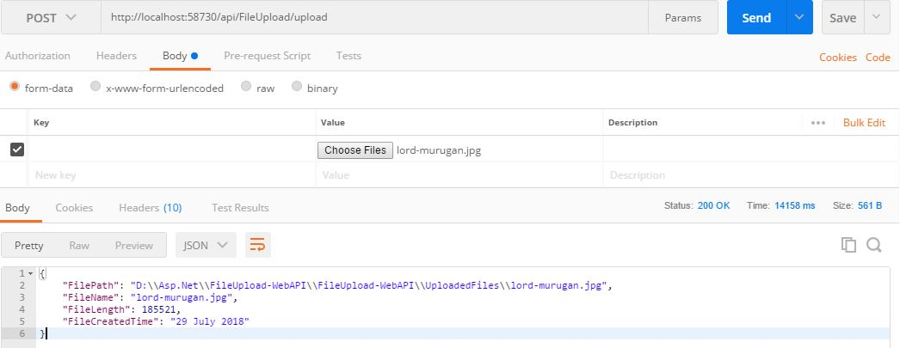

# FileUpload-WebAPI (Web API project for multi part file upload)
[FileUpload Angular6 Client](https://github.com/sarathlalsaseendran/FileUpload-Angular6) can be used from this location.

Clone/download the soultion and build with all Nuget packages.

Open Postman and upload any files less than 5MB size.

After successfull posting, a response with file details sent back to postman. 

